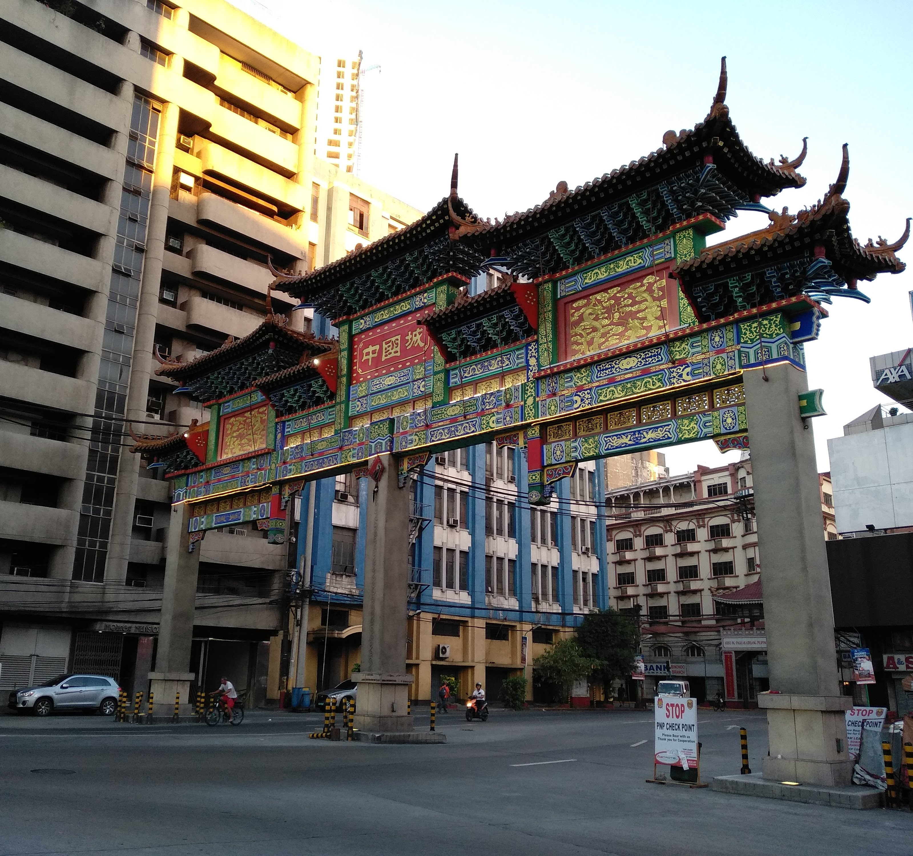

Scholarship on urban revitalization often treats municipal heritage designations as top-down branding exercises, imposed by the government to commodify ethnic spaces for tourism (Mabillar, & Echattabi, 2024). Under this view, local communities and their interests are set aside in favor of tourist consumption. However, interview data from members of the Davao City Chinatown Development Council complicates this assumption. Council members described a highly collaborative, negotiated process rather than one where they were dictated to. This transforms our understanding of the district's evolution: while the initial formalization was sparked by top-down, planned tourism goals, the actual execution functions as a negotiated, co-created space where the community's heritage and the state's economic interests actively cooperate. 

This collaborative planning model appears distinct to Davao. By contrast, in Manila's Chinatown, the construction of the newest archway in 2015 was a purely top-down initiative, under the district's rehabilitation program. Consequently, members of the Filipino-Chinese community expressed dissatisfaction with the arch, specifically criticizing the choice of the characters 「中國城」and the English label 'Chinatown'. They argue that this phrasing reflects a more mainland-centric perspective rather than honoring the distinct history and identity of the local Overseas Chinese community (Go, 2015). Instead, community members expressed a preference for the older arches built in the 1970s. These archways, similar to those in Davao, were constructed and funded by the local Filipino-Chinese community. As *The Urban Roamer* (2015) notes, because these earlier structures were built by and for the local residents rather than imposed by authorities, community members maintain a deeper cultural connection to them, viewing them as authentic markers of their shared identity rather than artificial tourism markers.

<div align="center">
    <div style="margin-bottom: 10px; text-align: center;">
    

<span style="font-size: 55%; display: block; text-align: center;">Aerous, CC BY-SA 4.0 <https://creativecommons.org/licenses/by-sa/4.0>, via Wikimedia Commons</span>
    </div>
<span style="font-size: 70%; display: block; text-align: center;">*Sta Cruz Archway, Manila, Philippines*</span>
</div>

Davao's collaborative dynamic directly aligns with the urban planning frameworks of Lew (2017) and Ungvarsky (2023). On the tourism place making continuum, Lew (2017) identifies "co-management, co-creation, and public participation" as the vital middle ground that bridges bottom-up, organic place-making with top-down, planned placemaking. By securing a permanent seat at the table for the Filipino-Chinese civic and academic leaders, the local government avoids placelessness, or the loss of unique local diversity (Lew, 2017). Instead, this participatory model serves as an example of place governance, an intentional collaborative effort to build mechanisms and processes that include the local community as co-creators in the making of public spaces (Lew, 2017). Furthermore, by incorporating the council's feedback, the development of Davao Chinatown fulfills the city ordinance's original goal: giving the often neglected Chinese community a voice in decisions that shape their own district. 

```{image} assets/archways/unity_park_sign.jpg
:alt: unity park signage
:width: 500px
:align: center
```